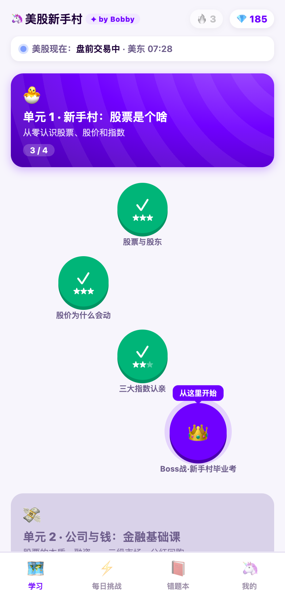
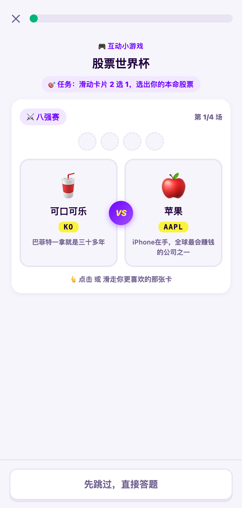
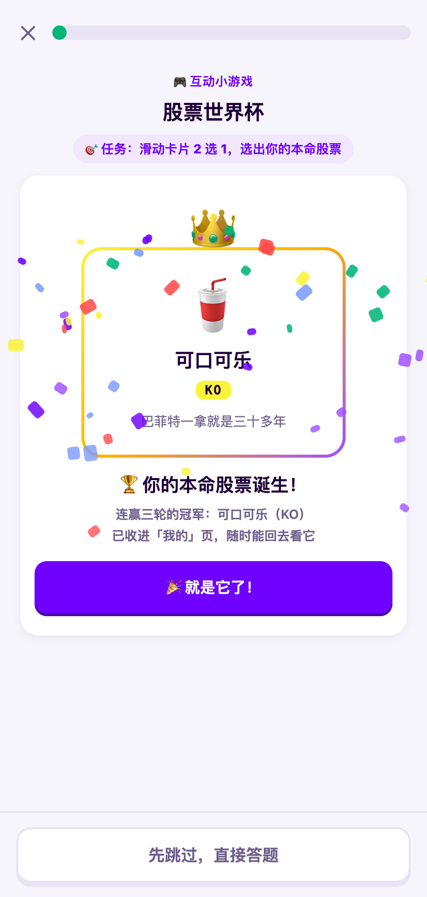
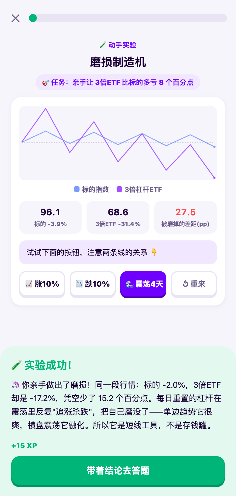
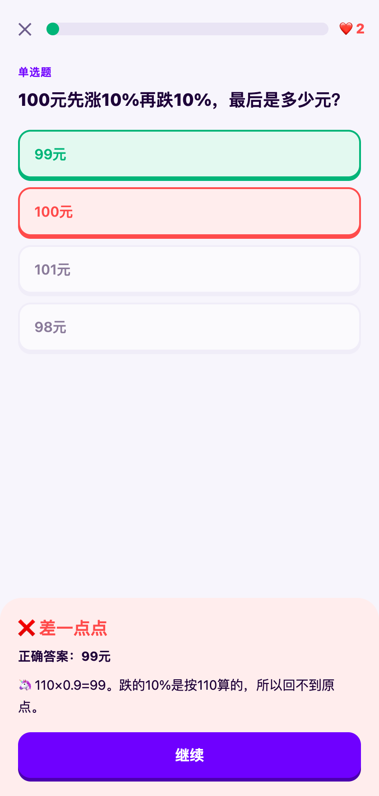
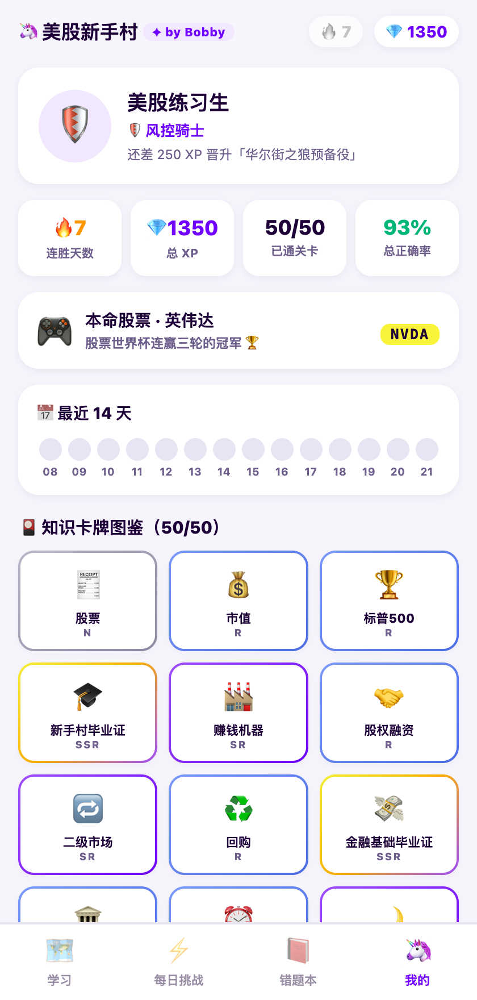
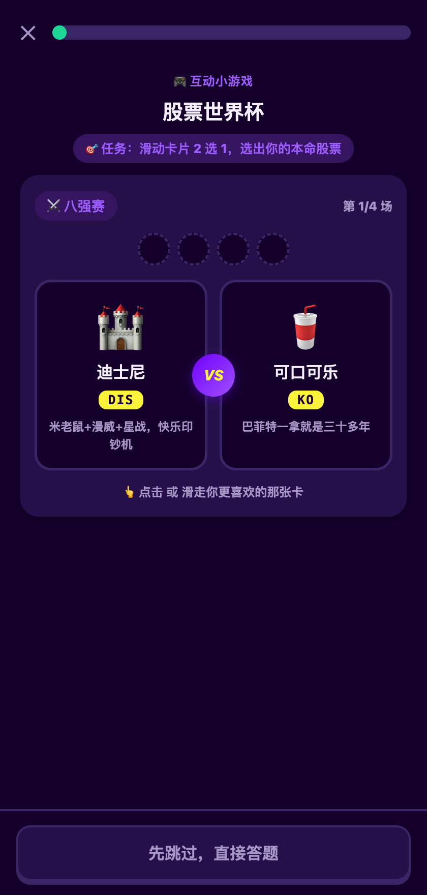

# 美股新手村 · BullCamp 🐂

> A Duolingo-style US-stock learning game — zero dependency, pure static web.

多邻国式美股投教小游戏：**10 大单元 · 50 关 · 320 题**，外加 9 个动手实验和 1 个「股票世界杯」互动小游戏。每天 5 分钟，从「韭菜幼苗」练成「传奇操盘手」。

零依赖 · 零构建 · 纯静态三件套（HTML/CSS/JS），可直接部署到任意静态托管，或塞进 App WebView。

🎮 **在线试玩**：https://wcy4213.github.io/bullcamp/ （手机打开体验最佳）

| 学习地图 | 股票世界杯 | 冠军加冕 |
| :---: | :---: | :---: |
|  |  |  |

| 动手实验 | 答题反馈 | 我的成就 |
| :---: | :---: | :---: |
|  |  |  |

## ✨ 特性

- **🗺️ 50 关闯关地图**——按认知逻辑排课：先搞懂股票是什么，再学下单、看行情、算估值，最后进阶杠杆、港股、3 倍 ETF
- **🎮 股票世界杯**——Tinder 式滑卡 2 选 1，8 只知名美股打淘汰赛，选出你的「本命股票」，顺手认全股票代码
- **🧪 9 个任天堂式动手实验**——爆仓模拟器、磨损制造机、下单时钟、捏 K 线……先玩出顿悟，再答题巩固
- **📖 教-考闭环**——永远不考没教过的东西：新知识点先给微教学，再出题
- **🎴 50 张知识卡牌图鉴**——每关首通掉落（N/R/SR/SSR），收集齐 = 核心概念全过一遍
- **💪 多邻国式数值系统**——XP / 星级 / 生命值 / 连胜 / 每日挑战 / 错题本 / 17 枚徽章 / 7 级称号
- **🌙 深色模式**——跟随系统自动切换
- **📴 无后端**——进度存 localStorage，断网也能玩

## 🚀 快速开始

```bash
git clone https://github.com/wcy4213/bullcamp.git
cd bullcamp
python3 -m http.server 8765
# 浏览器打开 http://localhost:8765（手机模拟 375px 宽体验最佳）
```

或者更简单——直接双击 `dist/美股新手村.html`（全部资源内联的单文件版本）。

## 🗺️ 课程地图

| # | 单元 | 内容 | 规模 |
|---|------|------|------|
| 1 | 🐣 新手村：股票是个啥 | 从零认识股票、股价和指数 | 4 关 26 题 |
| 2 | 💸 公司与钱：金融基础课 | 股票的本质、融资、一二级市场、分红回购 | 5 关 32 题 |
| 3 | 🗺️ 市场地图：几点开门 | 交易所、交易时间、盘前盘后、熔断 | 5 关 32 题 |
| 4 | 🎯 下单基本功 | 市价限价、点差、碎股、止损 | 5 关 32 题 |
| 5 | 📊 看懂行情 | K线、成交量、估值、财报季 | 5 关 32 题 |
| 6 | ⚖️ 估值课：给公司称重 | 价格与价值、PE 深入、PB/PS、估值的锚 | 5 关 32 题 |
| 7 | ⚡ 杠杆特训营 | 杠杆、保证金、杠杆 ETF 与磨损、做空 | 6 关 38 题 |
| 8 | 🛡️ 韭菜防身术 | 心态、仓位、防骗、长期主义 | 5 关 32 题 |
| 9 | 🇭🇰 港股入门 | 恒生指数、午休、一手制度、港股规则 | 5 关 32 题 |
| 10 | 🎢 3倍ETF特训 | 做多做空家族、使用纪律、2022 教训 | 5 关 32 题 |

## 🏆 股票世界杯（滑卡小游戏）

刚在新手村学完「股票代码」，马上进世界杯实战认代码：8 只国民级美股（🍎AAPL / 🚗TSLA / 🎮NVDA / 🍟MCD / 🥤KO / 🏰DIS / ☕SBUX / 👟NKE）随机配对，八强赛 → 半决赛 → 总决赛，每场滑卡或点选 2 选 1。

冠军加冕成你的**本命股票**，永久陈列在「我的」页；游戏结论顺势引出下一关主题（"你的本命股为什么天天上蹿下跳？"）。

<p align="center"></p>

## 🧪 互动实验室（做中学）

关卡内嵌可操作沙盘（`js/labs.js`），流程：知识卡片 → 动手实验 → 答题。完成 +15 XP，可跳过：

| 实验 | 关卡 | 顿悟点 |
|---|---|---|
| 股票世界杯 | u1l2 | 滑卡选本命股票，顺手认全 8 个股票代码 |
| 下单时钟 | u2l3 | 拨时钟在盘前/盘中/休市下单，遭遇完全不同 |
| 点差实验室 | u3l2 | 市价/限价单实操 + 冷门股点差踩坑 |
| 捏K线 | u4l1 | 拖滑杆捏出阳线/阴线/长上影 |
| 爆仓模拟器 | u5l2 | 选 5 倍杠杆过日子，把自己玩到强平 |
| 磨损制造机 | u5l4 | 按出震荡行情，亲眼看 3倍ETF 比标的多亏 |
| 复利时光机 | u6l4 | 调年化和年数，让 1 万变 4 万 |
| 港股下单时钟 | u7l2 | 午休时下单被挂起，体验港股特色作息 |
| 奶茶店估值器 | u10l2 | 给奶茶店定价三次，搞懂 PE 是情绪温度计 |
| 2022熊市回放机 | u8l4 | 按季度回放真实行情，亲手把 TQQQ 拿到 -80% |

## 🎯 游戏机制速查

- **XP**：首答对 +10 / 重答对 +5 / 通关 +20 / Boss +40 / 实验 +15
- **星级**：首答正确率 ≥90% 三星、≥70% 两星、通关一星
- **生命值**：普通关 3 颗、Boss 4 颗，答错 -1，归零重来；答错的题自动排到队尾重考
- **连胜**：每天完成任意一关或每日挑战点亮，断一天清零
- **每日挑战**：每天 5 题，从已通关卡随机抽（间隔复习）
- **错题本**：答错自动收录，复习答对移出
- **存档**：localStorage `bullcamp_state`，「我的 → 清空进度」可重置

## 📁 目录结构

```
bullcamp/
├── index.html            # 入口（SPA 壳 + 底部导航）
├── css/style.css         # 全部样式（含深色模式）
├── js/app.js             # 游戏引擎（地图/题型/数值/错题本/每日挑战）
├── js/labs.js            # 互动实验引擎 + 股票世界杯 + 知识卡牌
├── js/data.js            # 合并后的题库（自动生成，勿手改）
├── data/u1..u10.json     # 10 个单元的题库源文件（审校后版本）
├── tools/build_data.py   # 题库合并 + 结构校验
├── tools/build_single.py # 打包单文件版本
├── dist/美股新手村.html    # 单文件版，双击即玩
└── docs/项目策划.md       # 教研/产品/UX 完整策划书
```

## ✏️ 改题库 / 加内容

1. 编辑 `data/uN.json`（题型规格见 `docs/项目策划.md`）
2. 运行 `python3 tools/build_data.py`（自动校验：题型字段、答案索引、配对/排序项数）
3. 刷新页面即生效

**出题铁律（教-考闭环）**：永远不考没教过的东西。新概念必须带 `teach` 微教学字段；干扰项只用已教术语或生活常识。

加新实验/小游戏：在 `js/labs.js` 里加 `ENGINES.xxx` 引擎 + `LABS` 配置（可带 `tag` 字段自定义标签），无需改动游戏主引擎。

## 📄 License

[MIT](LICENSE) © 2026 wcy4213

---

*Built with [Claude Code](https://claude.com/claude-code) 🤖 · 教研内容仅供投资教育，不构成投资建议。*
